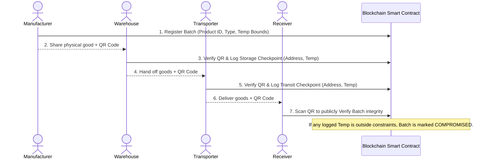

<div align="center">
  
  <h1>ChainChill</h1>
  <p><strong>Advanced Blockchain-Based Cold Chain Monitoring &amp; Compliance DApp</strong></p>
  
  <p>
    <a href="#overview">Overview</a> •
    <a href="#key-features">Key Features</a> •
    <a href="#how-it-works">How It Works</a> •
    <a href="#project-structure">Project Structure</a> •
    <a href="#getting-started">Getting Started</a> •
    <a href="#documentation">Documentation</a>
  </p>
</div>

---

## 📌 Overview

**ChainChill** is a production-grade decentralized application (DApp) engineered to eliminate fraud, human error, and tampering in temperature-sensitive supply chains. It acts as an immutable, trustless orchestrator for Cold Chains—the critical logistical pathways required to transport perishables like vaccines, frozen foods, and quick-commerce goods.

Operating entirely on the **Ethereum Sepolia Testnet**, ChainChill enforces strict, predefined environmental constraints through unalterable Smart Contracts. It bridges the physical and digital realms using an advanced QR-Code generation and live-camera scanning ecosystem. The result is mathematical certainty: consumers can verify with absolute confidence that their products were preserved exactly as mandated, from the factory floor to the final delivery.

---

## ✨ Key Features

### 1. Cryptographic Immutability & Status Automation
Every temperature checkpoint logged by a transporter or warehouse is permanently embedded into the Ethereum ledger. The smart contract acts as an automated auditor: if a single logged temperature falls outside the predefined product bounds (e.g., Pharma: 2°C to 8°C), the batch is permanently flagged as **COMPROMISED**. This flag is one-way and cannot be overridden by subsequent "good" temperatures.

### 2. Comprehensive QR Ecosystem
Manual data entry is prone to human error and deliberate falsification. Therefore, ChainChill uses QR codes as the primary interaction vector.
- **Manufacturers** have unique QR codes automatically generated upon registering a batch on-chain.
- **Handlers & Consumers** use the DApp's integrated `html5-qrcode` scanner via mobile or desktop cameras, or by uploading image files, to trace items instantly.

### 3. State-Aware Dynamic Dashboard
Rather than a static ledger view, ChainChill assesses the blockchain history of the currently connected MetaMask wallet. 
- Automatically identifies if the wallet belongs to a **Manufacturer** or a **Handler** (or both).
- Computes a dynamic **"Journey Progress"** pipeline (`Factory → Warehouse → Truck → Store`) based purely on aggregated on-chain events.
- Displays comprehensive analytical cards, highlighting specific temperature breaches directly attributed to your wallet.

### 4. Zero-Trust Public Verification
A fully public `Verify Batch` portal allows consumers to independently verify the safety of a product without taking Web3 actions (wallet connection is strictly passive/read-only). This portal renders a complete, chronological timeline of facility hand-offs, linking directly to Etherscan for handler identity verification.

### 5. Premium UI/UX & Design System
Reengineered from basic emojis to a sleek, modern aesthetic leveraging `lucide-react`. Custom CSS and responsive Tailwind utilities ensure the DApp feels native and polished on both mobile scanners and desktop management portals. Product types are denoted by a clean, color-coded "TypeDot" system.

---

## 🏗️ How It Works

### The Supply Chain Flow



---

## 📂 Project Structure

```text
chainchill-vaaniii/
├── src/
│   ├── components/
│   │   ├── Dashboard.jsx        # Role-aware interface & Journey Progress logic
│   │   ├── LogCheckpoint.jsx    # Handler UI: QR Scanner (camera/file) + Smart Contract Write
│   │   ├── RegisterBatch.jsx    # Manufacturer UI: Batch creation + QR Generation
│   │   └── VerifyBatch.jsx      # Public UI: Read-only chronological tracking & alerts
│   ├── App.jsx                  # Main orchestrator, Routing, MetaMask initialization
│   ├── contractConfig.js        # Ethereum Smart Contract ABI and Sepolia Address
│   ├── index.css                # Custom UI tokens, variables, animations, and Tailwind imports
│   └── main.jsx                 # React root injection
├── docs/
│   ├── ARCHITECTURE.md          # Deep technical breakdown and data workflows
│   └── USER_GUIDE.md            # Step-by-step manual and edge-case troubleshooting
├── index.html                   # HTML template
├── package.json                 # Dependency tree (React, ethers v6, html5-qrcode, lucide)
├── tailwind.config.js           # Utility styling configurations
└── vite.config.js               # Development server & CSP configurations
```

---

## 🚀 Getting Started

### Prerequisites

- **Node.js**: v18 or newer.
- **Wallet**: MetaMask browser extension securely installed.
- **Network**: Configured to the **Sepolia Testnet**.
- **Funds**: Sepolia Testnet ETH (Required for gas fees when executing `registerBatch` or `logCheckpoint`). *Use a public Sepolia faucet if your balance is 0.*

### Installation & Setup

1. **Clone the repository**:
   ```bash
   git clone <your-repo-url>
   cd chainchill-vaaniii
   ```

2. **Install dependencies**:
   ```bash
   npm install
   ```
   *(Crucial Dependencies: `ethers@6`, `lucide-react`, `qrcode.react`, `html5-qrcode`, `tailwindcss`, `vite`).*

3. **Start the development server**:
   Vite is configured to handle Hot Module Replacement with a relaxed CSP.
   ```bash
   npm run dev
   ```

4. **Open application**:
   Navigate to `http://localhost:5173` in your MetaMask-enabled browser via Desktop or Mobile.

---

## 📚 Detailed Documentation

For a comprehensive dive into the codebase operations and user handling:

- 📐 [**Architecture Details**](./docs/ARCHITECTURE.md) - Deep dive into Solidity logic, Ethers.js integration, Web3 security models, and component structure.
- 🗺️ [**User Guide & Troubleshooting**](./docs/USER_GUIDE.md) - Step-by-step instructions for all features, including recovering from MetaMask rejections and resolving camera permissions.

---

## 💻 Tech Stack Highlights

- **Frontend Core**: React 18 (Vite Bundler for rapid HMR)
- **Styling**: Tailwind CSS coupled with custom vanilla CSS (`index.css`) for complex gradients and micro-animations.
- **Iconography**: `lucide-react` (SVG-based scalable icons ensuring a highly professional, zero-emoji UI).
- **Web3 Interaction**: `ethers.js` (v6) acting as the bridge via `window.ethereum`.
- **Scanning Ecosystem**: `html5-qrcode` handles device orientation parsing and image file decoding; `qrcode.react` handles immediate canvas rendering.
- **Blockchain Target**: Solidity Smart Contracts on Ethereum Sepolia.

---
<div align="center">
  <i>Providing mathematical certainty to the freshness of your global supply chain.</i>
</div>
