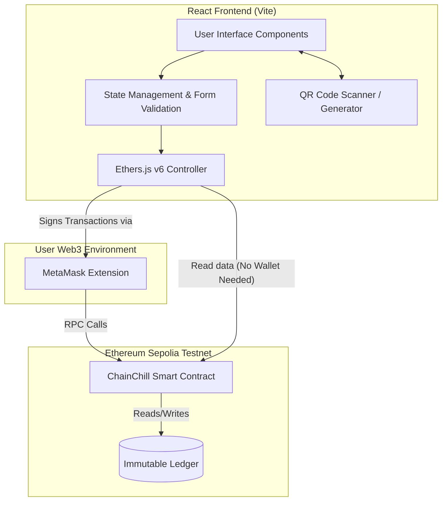

# ChainChill Architecture & Technical Detail

This document outlines the architectural components, smart contract design, data flow, and frontend logic of the ChainChill decentralized application.

## 🏗️ High-Level System Architecture

ChainChill operates on a standard Web3 paradigm, keeping the centralized backend footprint to zero. All business logic, state changes, and historical records live perfectly immutably on the Ethereum Sepolia TestNet.



---

## 📜 Smart Contract Design

The `ColdChain` smart contract forms the backbone of the application. It ensures cryptographic enforcement of rules and serves as the single source of truth for the entire supply chain footprint.

### Data Structures

The contract relies on two primary data structures:

1. **`Batch` Struct**
   - **`batchId`** *(string)*: Unique string identifier (e.g., `BATCH-001`).
   - **`productName`** *(string)*: Human-readable name of the goods.
   - **`productType`** *(string)*: Classification used to render UI dots (`pharma`, `frozen`, `fresh`, `quickcommerce`).
   - **`minTemp` & `maxTemp`** *(int256)*: The permissible temperature boundaries.
   - **`expiryDate`** *(uint256)*: Unix timestamp indicating product spoilage date.
   - **`manufacturer`** *(address)*: Creator of the batch.
   - **`isCompromised`** *(bool)*: A completely permanent, one-way flag. Starts `false`. Turns `true` if any logged temperature breaches bounds.
   - **`createdAt`** *(uint256)*: Registration timestamp.

2. **`Checkpoint` Struct**
   - **`handlerAddress`** *(address)*: Wallet address of the entity logging the temperature.
   - **`handlerName`** *(string)*: Physical name/org (e.g., "BlueDart Logistics").
   - **`handlerRole`** *(string)*: Role identifier (e.g., `warehouse`, `transporter`).
   - **`temperature`** *(int256)*: Recorded Celsius reading.
   - **`location`** *(string)*: Geographic or facility location.
   - **`isBreach`** *(bool)*: Flag set securely inside the smart contract during logging indicating if *this specific reading* caused an error.
   - **`timestamp`** *(uint256)*: Time of log.

### Function Mapping & Network Calls

The React frontend executes specific ABI calls to interact with these structures:

| Function | Type | Caller Component | Description |
| :--- | :--- | :--- | :--- |
| `registerBatch` | **Write** | `RegisterBatch.jsx` | Invoked by Manufacturer. Stores a new `Batch` and pushes to the `batchIds` array. Requires Gas. |
| `logCheckpoint` | **Write** | `LogCheckpoint.jsx` | Invoked by Handlers. Pushes a new `Checkpoint` to a mapping array. Automatically computes `isBreach` and potentially flips the batch `isCompromised` flag. Requires Gas. |
| `getBatch` | Read | Multiple | Fetches the tuple of data for a specific string ID. Free operation. |
| `getCheckpoints` | Read | `Dashboard`, `VerifyBatch` | Returns an array of checkpoints for a batch to build the chronological timeline. Free operation. |
| `getAllBatchIds` | Read | `Dashboard.jsx` | Returns all known string IDs to allow the Dashboard to dynamically find matching wallet activity. Free operation. |
| `batchExists` | Read | `LogCheckpoint.jsx` | Validation check executed *before* allowing the user to sign a metadata transaction to prevent wasting gas on invalid IDs. Free operation. |

### The Immutable Compromise Logic

The most critical security feature of ChainChill is that **breaches cannot be reversed**.
When a handler logs a checkpoint via `logCheckpoint(...)`, the smart contract executes the following:

```solidity
bool breach = (temp < batch.minTemp || temp > batch.maxTemp);
if (breach) {
    batch.isCompromised = true;
}
```

Once `batch.isCompromised` becomes `true`, it is mathematically impossible for any subsequent good reading to flip it back to `false`. The damage is permanent and financially provable.

---

## 🎨 Frontend Technical Implementation

### Wallet & Provider Strategy (Ethers.js v6)

The application handles web3 connections via `BrowserProvider`.
- **Write Operations:** Form submissions are blocked if `window.ethereum` is undefined or no `account` is detected. Connect MetaMask buttons inject the provider explicitly requesting `eth_requestAccounts`.
- **Read Operations:** Specifically in the "Verify Batch" view, the app falls back to a public Sepolia RPC URL via `JsonRpcProvider` if no wallet is connected. This empowers non-crypto users to audit supply chains just by scanning the QR code with their mobile device browser.
- **Provider Hooking:** `App.jsx` handles network change listener events (`chainChanged`) and account changes (`accountsChanged`) to immediately update the global state. 

### Component Breakdown

| File / Component | Architectural Role | Key Flow / Hook Highlights |
| :--- | :--- | :--- |
| `App.jsx` | Core Orchestrator | `useState` for active Tab. Intercepts Sepolia wrong-network errors. Passes `contract` (Signer-enabled) and `readContract` (Provider-only) downward. |
| `Dashboard.jsx` | Dynamic Engine | Fetches *all* batches, iterates them, and filters them strictly based on where `account` matches `batch.manufacturer` or inside `cp.handlerAddress`. |
| `RegisterBatch.jsx` | Form Validation | Implements the `PRODUCT_INFO` constraints. Will block sub-zero entries for Fresh dairy or allow it strictly for Frozen. Returns TxHash on success. |
| `LogCheckpoint.jsx` | Hardware Access | Conditionally loads `html5-qrcode`. Handles dynamic unmounting via `useEffect()` cleanup so the camera tracking light turns off reliably. |
| `VerifyBatch.jsx` | Public View | Focuses on aggressive visual indicators (Big Green/Red banners). Maps raw integer timestamps into localized device `Intl.DateTimeFormat`. |

### The "Journey Progress" Algorithm

Inside `Dashboard.jsx`, the app calculates supply chain progression natively.
1. It knows the manufacturer holds the first slot implicitly upon batch registration.
2. It fetches all `checkpoints[batchId]`.
3. It performs a case-insensitive `.includes()` check against handler roles:
   ```javascript
   const w = roles.some(r => r.includes('warehouse'))
   const t = roles.some(r => r.includes('transporter'))
   const r = roles.some(r => r.includes('receiver'))
   ```
4. This powers the visual breadcrumbs (`🏭 → 🏢 → 🚚 → 🏪`) updating dynamically in real-time.

### The CSS Design System & Assets

ChainChill completely abandoned emoji-based iconography in favor of mathematical CSS and SVG vectors:
- **`TypeDot`**: A tiny React component that accepts `productType` and renders a pure CSS `#id` dot (`#3b82f6` for Pharma, `#6366f1` for Frozen, etc.).
- **Lucide-React SVG**: Highly efficient vectors dynamically sized via React props.
- **`index.css` Utilities**: We use raw variables (`var(--cc-text)`) alongside complex background gradients (`linear-gradient(135deg, ...)`) to circumvent bulky Tailwind configs, ensuring ultra-fast repaint speeds.

### QR Capability & Security

**Encoding/Decoding Loop:**
- Generation uses `qrcode.react` to render `<canvas>` elements representing pure, raw string `batchId`s.
- Decoding leverages `html5-qrcode`, capturing base text inputs via file buffers or real-time WebRTC camera streams.
- *Security Note:* The QR code itself is just a mechanism for string transference. Security is handled entirely by the cryptographic signature required to submit the log via MetaMask. Simply pointing an unauthorized scanner at a DApp QR won't execute malicious transactions.
